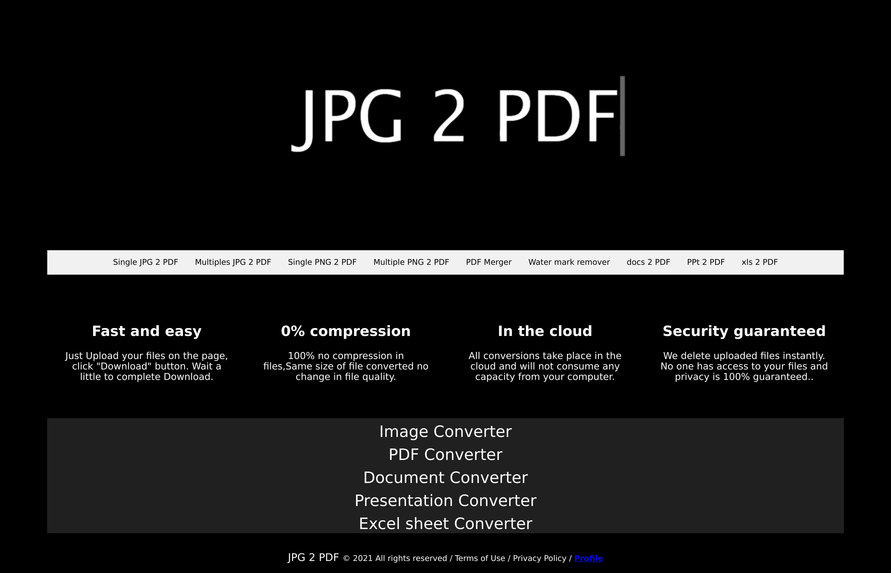

# IMG_2_PDF_Website💻USING FLask🐍🐍
## [LINK TO WEBSITE](https://jpg2pdf-file-converter.herokuapp.com/)

This webapp created on Flask which can convert image into PDF and multiple pdfs to Single pdf.

### Visit My Profile: [Ayush Shete](https://in.linkedin.com/in/ayushshete)

### Code Requirements
- Flask(`pip install flask`)
- img2pdf(`pip install img2pdf`)
- and more(`follow requirement.text`)
       `atomicwrites==1.4.0
       attrs==20.3.0
       bleach==3.3.0
      certifi==2020.12.5
      chardet==4.0.0
      click==7.1.2
      colorama==0.4.4
      docutils==0.17.1
      docx2pdf==0.1.7
      Flask==1.1.2
      gunicorn==20.1.0
      i2p==5.2.0
      idna==2.10
      img2pdf==0.4.0
      importlib-metadata==4.0.1
      iniconfig==1.1.1
      itsdangerous==1.1.0
      Jinja2==2.11.3
      keyring==23.0.1
      lxml==4.6.3
      MarkupSafe==1.1.1
      packaging==20.9
      pikepdf==2.11.4
      Pillow==8.2.0
      pkginfo==1.7.0
      pluggy==0.13.1
      py==1.10.0
      Pygments==2.8.1
      pyparsing==2.4.7
      PyPDF2==1.26.0
      pytest==6.2.3
      pywin32-ctypes==0.2.0
      readme-renderer==29.0
      requests==2.25.1
      requests-toolbelt==0.9.1
      rfc3986==1.4.0
      six==1.15.0
      toml==0.10.2
      tqdm==4.60.0
      twine==3.4.1
      urllib3==1.26.4
      webencodings==0.5.1
      Werkzeug==1.0.1
      zipp==3.4.1`
      

### What steps you have to follow??

- Run `app.py`
- Go to ` http://127.0.0.1:5000/`

### DEMO : [Demo Video](https://www.linkedin.com/embed/feed/update/urn:li:ugcPost:6795355074357985280?compact=1)

### Screenshots  
# (1)

# (2)
.png)
# (3)
.png)
# (4)
.png)
# (5)
.png)

## Just follow☝️ me and Star⭐ my repository 
